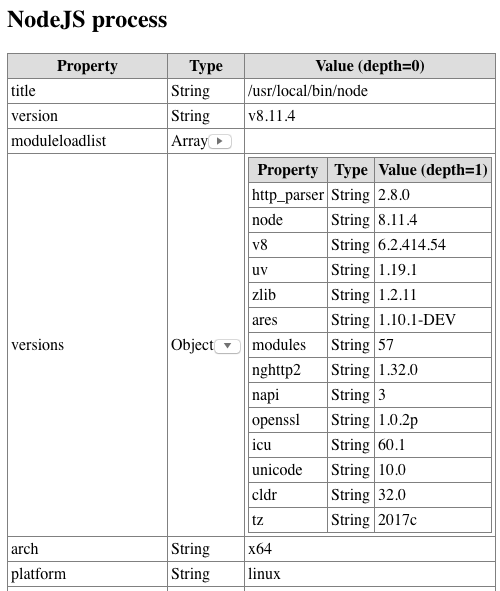

# Basic Formatting Utilities

## Overview

This NPM module contains a simple set of utilities to format a JavaScript object into an HTML table as per the screen shot below.



### Behaviour

* Object properties are listed in alphabetic order
* Only object properties of type `Object`, `Array`, `Map` or `Set` are considered expandable
* Click on the expand/collapse button in the `Type` column to hide or display this data
* By default:
    * Expandable object properties will be displayed in a collapsed state
    * Object properties of types `Function` and `GeneratorFunction` will be suppressed from the display

### But Why?

I wrote this utility primarily to overcome the problem that many standard JavaScript objects (such as an HTTP `request` object or NodeJS's `global` object) contain circular references that cause `JSON.stringify` to explode.

Therefore, rather than resorting to the tedious, trial-and-error approach of repeatedly calling `JSON.stringify` within a `try`/`catch` block, I thought I could achieve a more user-friendly result by writing my own solution.

## Usage

The `show_object` function transforms a JavaScript object into an HTML table.  If any property of this object is expandable (I.E. is of type `Map`, `Object`, `Array` or `Set`), then this property value will itself be transformed into a nested HTML table.

Transformation of expandable properties continues recursively until the predetermined depth limit is reached.

By default, the depth limit is set to 3, but this can be adjusted by passing a positive integer to `set_depth_limit()`

If you wish the output table to contain the names of object properties of type `Function` or `GeneratorFunction`, then call function `show_fns()`.  

***IMPORTANT***  
Function source code will not be displayed.

Typically, the HTML generated by this utility will form just a fragment of the overall Web page generated by some larger app.

### Example 1: Display a Single Object as an HTML `<DIV>`

Call `show_object` to transform the contents a server-side object into an HTML `<DIV>` containing a `<TABLE>`:

```javascript
var bfu     = require('basic-formatting-utils')
var request = ... /* Get an HTTP request object from somewhere */

var obj_as_html_div = bfu.show_object("HTTP Request", request)
```

### Example 2: Display a Single Object as an Entire HTML Page

Enclose the call to `show_object` within calls to `as_body` and `as_html` in order to generate a complete HTML page instead of just a `<DIV>` fragment.  Also display the names of function properties:

```javascript
var bfu     = require('basic-formatting-utils')
var request = ... /* Get an HTTP request object from somewhere */

bfu.show_fns()

var obj_as_html_page = 
  bfu.as_html([]
  , bfu.as_body([]
    , bfu.show_object("HTTP Request", request)
    )
  )
```


### Example 3: Display Multiple Objects as an HTML `<DIV>`

Call `show_objects` (plural) to transform multiple objects into separate `<DIV>` elements that are then returned within a parent `<DIV>`:

```javascript
var bfu     = require('basic-formatting-utils')
var request = ... /* Get an HTTP request object from somewhere */
var event   = ... /* The HTTP event that invoked this function */

bfu.show_objects([
  {title: "HTTP request", value: request}
, {title: "HTTP event",   value: event}
])
```

### Example 4: Convenience Functions

Hardcoded functions that return the contents of the NodeJS `process` and `global` objects respectively as HTML `<DIV>` fragments.

```javascript
var bfu = require('basic-formatting-utils')
    
var process_as_html_div = bfu.show_nodejs_process()
var global_as_html_div  = bfu.show_nodejs_global()
```


## API

### Low-level Utilities

| Name | Return Type | Description
|---|---|---|
| `package_version` | `String` | Returns this utility's current package version
| `sizeOf` | `Number` | Returns the number of enumerable elements/properties within an expandable object (see `isExpandable` below). Returns `0` for all other data types

### Datatype Identifiers

| Name | Return Type | Description
|---|---|---|
| `typeOf` | `String` | Returns the actual data type of the object
| `isOfType` | `Function` | Partial function that creates a function to check for a specific data type.<br>E.G. If you want your own type checking function to test for an `ArrayBuffer`, then you could write<pre>var isArrayBuffer = isOfType("ArrayBuffer")</pre>
| `isArray` | `Boolean` | Does exactly what it says on the tin...
| `isBigInt` | `Boolean` | Does exactly what it says on the tin...
| `isExpandable` | `Boolean` | Returns `true` only for those objects whose content is considered expandable.<br>Currently, this applies only to `Object`, `Array`, `Map` or `Set`.
| `isFunction` | `Boolean` | Returns `true` for objects of type `Function` or `GeneratorFunction`
| `isMap` | `Boolean` | Does exactly what it says on the tin...
| `isNull` | `Boolean` | Does exactly what it says on the tin...
| `isNullOrUndef` | `Boolean` | Does exactly what it says on the tin...
| `isNumber` | `Boolean` | Does exactly what it says on the tin...
| `isNumeric` | `Boolean` | Returns `true` if the argument is either of type `Number` or `BigInt`
| `isObject` | `Boolean` | Returns `true` both for a standard JavaScript `Object` and the NodeJs objects `process` and `global`.<br>The latter two objects were included in this test because they return their own names when passed to `typeOf()`.  The NodeJS object `WebAssembly` also behaves this way, but is deliberately ignored here.
| `isSet` | `Boolean` | Does exactly what it says on the tin...
| `isSymbol` | `Boolean` | Does exactly what it says on the tin...
| `isUndefined` | `Boolean` | Does exactly what it says on the tin...

### HTML Utilities

| Name | Return Type | Description
|---|---|---|
| `as_html_el` | `Function` | A partial function that accepts an HTML tag name such as `p` or `table` or `img` etc., and returns a function requiring two arguments.  See `as_<tag_name>` below.
| `as_<tag_name>` | `String` | <p>A set of functions generated by calling the partial function `as_html_el`.</p><p>E.G. to create a function that generates an HTML paragraph element, you could write:<pre>var as\_p = as\_html\_el("p")</pre>Function `as_p` then requires two parameters:<ol><li>An array of the element's property values.  <br>Pass an empty array if the element does not need any defined properties</li><li>The element's content in a form that is either a string, or where calling that object's `toString()` function returns something useful</li></ol><p>Any content passed to an empty HTML element (such as `img`) will be ignored</p><p>E.G. To generate an HTML `<table>` element where the `border` is defined and all the table rows have been built up in some accumulator array `acc`, the call would be something like:</p><pre>as_table(["border=\\"1\\""], acc.join(""))</pre> 
| `get_depth_limit` | `Number` | Returns the current recursion depth limit for displaying nested objects
| `set_depth_limit` | `Number` | Sets a new recursion depth limit for displaying nested objects. <br>The default depth is 3.
| `show_fns` | `Boolean` | Switches on the display of object properties of type `Function`
| `hide_fns` | `Boolean` | Switches off the display of object properties of type `Function`

### Main Entry Point

| Name | Return Type | Description
|---|---|---|
| `create_content` | `String` | Deprecated in favour of `show_objects`
| `show_objects` | `String` | Takes an object array as a single argument in which each object contains the following two properties<ol><li>`title` - Some header text to describe the object.<br>Do not include any formatting or encoded characters in this description as it is used to generate the value of the collapsible `DIV`'s `id` property.</li><li>`value` - The object to be displayed</li></ol>E.G. To display some HTTP request object `req`, you would write:<pre>show_object([{title: "HTTP request", value: req}])</pre>Returns a `DIV` element containing the following children:<ol><li>A small style sheet</li><li>One or more `DIV` elements for each received object, each of which contains:<ul><li>The object's title</li><li>The object represented as an HTML table</li></ul></li><li>A small block of JavaScript that:<ul><li>Populates each arrow image's `src` property</li><li>Defines the `expand`/`collapse` functions</li></ul></li></ol>
| `show_object` | `String` | Convenience function for calling `show_objects` when only a single object needs to be displayed.<br>E.G. To display some existing HTTP request object `req`, you would write:<pre>show_object("HTTP request", req)</pre>


### Convenience Functions for NodeJS Objects

| Name | Return Type | Description
|---|---|---|
| `show_nodejs_global` | `String` | Transforms the NodeJS `global` object into an HTML `<DIV>` fragment
| `show_nodejs_process` | `String` | Transforms the NodeJS `process` object into an HTML `<DIV>` fragment


### Date/Time Functions

| Name | Return Type | Description
|---|---|---|
| `datetime_by_timezone` | `String` | A partial function that receives the offset (in minutes) of a given timezone from UTC and returns a function, that when passed a `new Date()` object, returns the current time in that timezone as a human readable string.<br><pre>var datetime\_jst = datetime\_by\_timezone(540)  /* Japan Standard Time is UTC+9 \*/<br>var tokyo\_time   = datetime\_jst(new Date())<br><br>var datetime\_brt  = datetime\_by\_timezone(-180)  /* Brasilia Time is UTC-3 \*/<br>var brasilia\_time = datetime\_brt(new Date())</pre>
| `datetime_<timezone>` | `String` | When passed a `new Date()`, returns the current time for the particular zone.<br>The only pre-configured timezone functions are:<ul><li>`UTC-8.0` US Pacific Standard Time (`_pst`)</li><li>`UTC-5.0` US Eastern Standard Time (`_est`)</li><li>`UTC+0.0` Greenwich Mean Time (`_gmt`)</li><li>`UTC+1.0` Central European Standard Time (`_cet`)</li><li>`UTC+5.5` India Standard Time (`_ist`)</li></ul>


